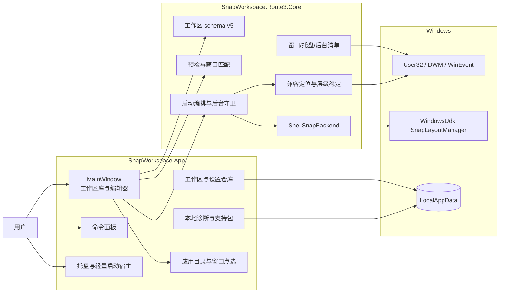
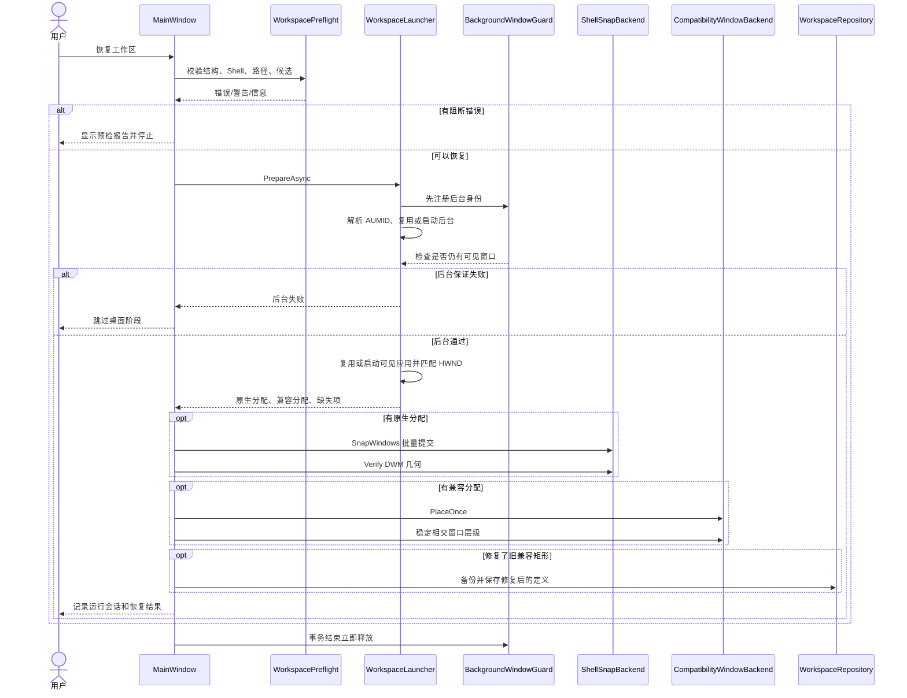

# 架构与恢复链路

本文面向维护者和希望理解底层行为的高级用户，说明 Snap Workspace 0.9.6 的组件、数据流、原生 Shell 调用、恢复事务和失败语义。

> Route 3 使用私有 Windows Shell WinRT 合同。实现必须维持“运行时接口能力 + 完整原生模型 + 结果验证”三道门，不能只因哈希已知或调用返回成功就宣称创建了 Snap Group。

## 技术栈与设计目标

| 层 | 技术 | 选择原因 |
|---|---|---|
| UI | .NET 10 WPF、内置 Fluent 主题 | 原生 Windows 桌面、DPI/无障碍成熟，不引入浏览器运行时 |
| 应用常驻 | `Shell_NotifyIcon`、消息窗口、单实例事件 | 启动项可只创建轻量托盘宿主，按需构建主窗口 |
| 系统交互 | C# P/Invoke、COM/WinRT ABI | 枚举 HWND、读取 DWM 边界、调用私有 Snap 管理器 |
| 持久化 | `System.Text.Json`、本地 JSON/ZIP | 文件透明、可备份、易迁移，无数据库依赖 |
| 发布 | `dotnet publish`、PowerShell、可选 MSIX | 同时提供框架依赖和 self-contained x64 包 |

项目接受 WPF 与完整现代 UI 的合理常驻内存，不为追求极小工作集而牺牲可读性、DPI 或交互。启动项路径通过轻量宿主降低不使用主窗口时的构造成本。

## 组件边界



### `SnapWorkspace.App`

- `MainWindow`：页面切换、创建/捕捉/编辑、恢复事务入口和运行会话；
- `CommandPaletteWindow`：搜索动作与工作区，键盘执行；
- `VisualLayoutEditorWindow`：可视化选择并规范化到原生布局；
- `InstalledApplicationPickerWindow`：开始菜单、注册程序和 AppsFolder 应用目录；
- `WindowPickerService`：低级鼠标/键盘钩子，点选任意顶层窗口；
- `WorkspaceRepository` / `SettingsRepository`：原子写入、历史备份和导入导出；
- `TrayIconService` / `StartupTrayHost`：完整 UI 与登录启动两种托盘宿主；
- `GlobalHotkeyService`：`RegisterHotKey`、`MOD_NOREPEAT`、冲突检查；
- `DiagnosticSupportService`：匿名 JSONL 与隐私受控 ZIP 支持包。

### `SnapWorkspace.Route3.Core`

- `WorkspaceModels`：schema v5、校验、迁移、匹配规则；
- `BuiltInLayouts` / `NativeSnapLayoutCatalog`：10 个原生模型和精确模型门；
- `WindowCatalog`：可见顶层窗口、身份和 DWM 边界；
- `TrayIconCatalog` / `RunningApplicationCatalog`：通知区域和纯后台候选；
- `WorkspacePreflight`：结构、Shell、路径、候选歧义检查；
- `WorkspaceLauncher`：后台前置、复用/启动、等待与路由；
- `BackgroundWindowGuard` / `WindowAppearanceWatcher`：事件驱动隐藏和扫描兜底；
- `ShellSnapBackend`：私有 ABI 探测、提交和几何验证；
- `CompatibilityWindowBackend`：一次定位及冷启动层级稳定；
- `WorkspaceWindowLifecycle`：安全发送 `WM_CLOSE`。

## 原生 Snap 的调用链

接口的发现依据、历史版本证据和 ABI 细节见 [原生 Snap 调用原理](NATIVE_SNAP_INTERNALS.md)；建议系统版本和公开更新边界见 [Windows 兼容说明](WINDOWS_COMPATIBILITY.md)。

### 能力探测

`ShellSnapBackend.Probe()` 不移动窗口，只验证当前环境：

1. 找到 `windowsudk.shellcommon.dll`，记录版本并计算 SHA-256；
2. 通过 `RoGetActivationFactory` 激活 `WindowsUdk.UI.Shell.SnapLayoutManager`；
3. 调用静态 `IsSupported`；
4. 按主显示器工作区调用 `CreateForWorkAreaRect`；
5. 查询 `ISnapLayoutManager2`、`3`、`4`；
6. 读取长轴/短轴最大窗口策略；
7. 汇总有效单次窗口上限、兼容等级和失败原因。

0.9.6 保留以下已验证 Shell 哈希作为诊断分类依据：

```text
6F48A36E81DAA0A23AB5CE89F3BBC0B2ADE13BCD24B82C837300C25262675741
```

该值不是微软公开兼容承诺，也不再是启用门。哈希匹配且接口探测通过时为 `KnownBaseline`；哈希未知但全部运行时能力通过时为 `RuntimeCompatible`；能力探测失败时为 `Unavailable`。只有最后一种状态会关闭 Route 3。

### 提交原生布局

`Snap()` 依次检查：

- 布局结构有效；
- `NativeSnapLayoutCatalog.FindExact()` 能找到完整内置模型；
- 工作区矩形有效；
- 至少一个分配且不超过上限；
- Zone 不重复；
- 本次会话的运行时能力探测通过；
- 每个 HWND 可转换为 WindowId。

随后构造两个等长数组：WindowId 数组和目标 `Rect` 数组。目标矩形由归一化 Zone 映射到当前主工作区。后端创建管理器、查询 `ISnapLayoutManager3`，从 vtable 调用 `SnapWindows`。

当前 WindowId 提供器仍将有效 HWND 的位值转换为 `ulong`，这是已有环境验证过的假设，不是跨版本转换保证；公开互操作函数的后续评估见上述调用原理文档。

调用返回后，上层等待配置的验证延迟，再用 DWM extended frame bounds 读取每个窗口实际可见矩形。四边误差默认容许 12 像素；任何窗口未到位都会把结果标记为失败并建议回退或重新提交完整布局。

### 为什么不在提交后修位置

`SnapWindows` 成功与几何到位是必要证据，但仍不能把任意矩形视作原生模型。对同一窗口追加 `SetWindowPos` 会引入第二套布局权威，破坏“Windows Shell 是原生窗口最终控制者”的原则。因此：

- 原生窗口只走 Shell；
- 兼容窗口只走一次定位；
- 两类窗口使用不同集合；
- 验证失败只报告，不偷偷校正。

## 完整恢复事务



### 阶段一：预检

预检不改变外部状态。阻断项包括：

- 工作区或 Zone 无效；
- 原生几何不是完整内置模型；
- 原生窗口超过有效上限；
- 当前 Shell 不可用；
- 当前无匹配窗口且启动目标缺失；
- 必需的可执行文件不存在。

工作目录缺失、Shell 仍在探测或候选同分属于警告。信息项会说明某应用已就绪或需要启动。

### 阶段二：严格后台

后台应用先经过 `ShellAppResolver.Enrich()`，把可能是桌面快捷身份的 AUMID 解析为实际 EXE。守卫在启动前注册，避免窗口在进程创建与规则建立之间闪现。

通用守卫包含两层：

- `SetWinEventHook` 监听 `EVENT_OBJECT_CREATE` 和 `EVENT_OBJECT_SHOW`，尽快隐藏匹配窗口；
- 定时扫描作为事件缺失时的兜底，并扩展被跟踪进程的子进程树。

启动 600 毫秒后执行明确检查。只要仍有匹配可见窗口，该后台项标记失败，桌面阶段不再执行。

应用专用策略：

- Chromium：添加 `--no-startup-window`，禁用通用隐藏守卫，保留已有用户窗口；
- Everything：先发 `-close`，等待 250 毫秒，再以 `-startup` 启动，并继续使用守卫；
- 其他：普通隐藏启动提示 + 守卫。

### 阶段三：准备可见窗口

对每个窗口应用：

1. 如果不要求新实例，先在当前候选中寻找最高分窗口；
2. 找不到且可启动，则启动应用；
3. 最多 15 秒、每 250 毫秒重新枚举窗口；
4. `AlwaysStartNewInstance` 要求匹配新出现的 HWND；
5. 如果目标标为原生但当前样式不支持 Snap，改建对应 Zone 的兼容分配；
6. 记录启动状态、匹配分数和原因。

Windows 设置等系统表面通过规范 URI 启动。捕捉到的 `ApplicationFrameHost.exe` 只保留作窗口身份，启动目标迁移为 `ms-settings:`。

### 阶段四：原生提交和验证

上层只对 `prepared.Assignments` 调用一次 `Snap()`，然后在 250–1500 毫秒范围内等待设置的验证延迟，调用 `Verify()`。

没有原生窗口的工作区不会调用 Shell。只有后台或只有兼容窗口的工作区仍是合法工作区。

### 阶段五：兼容定位和遮挡稳定

兼容矩形相对当前主工作区映射为物理像素，`PlaceOnce()` 只执行一次定位。若该次恢复冷启动了可见窗口，且兼容窗口与原生窗口相交，则在有限时间内给兼容窗口临时前景租约，等待晚激活的原生应用稳定，最后取消置顶状态。

0.9.5 还会修复旧版异常矩形：

1. 检查保存矩形是否可用；
2. 尝试读取当前 HWND 的 DWM 可见边界和 `WINDOWPLACEMENT.rcNormalPosition`；
3. 保持窗口尺寸，整体平移回工作区；
4. 仍无法获得有效矩形时使用安全区域；
5. 成功恢复后由仓库先备份旧 JSON，再保存修复结果。

### 阶段六：会话与清理

成功后，UI 记录管理的 HWND、是否由本次启动和后台启动计数。无论成功、失败还是异常，`finally` 都会释放后台守卫，使事务后的用户操作不受隐藏规则影响。

## 捕捉与识别链路

智能捕捉并不是先限制为 4 个进程。它先建立完整应用清单，再把原生子集限制为 4 个：

1. `WindowCatalog` 枚举任务栏候选并读取标题、路径、AUMID、类名和可见矩形；
2. `TrayIconCatalog` 读取通知区域注册，和运行进程路径求交；
3. `RunningApplicationCatalog` 从剩余进程中建立纯后台候选；
4. 按任务栏、托盘、后台优先级对启动目标去重；
5. 应用屏蔽规则；
6. 自动建议角色，再应用用户记住的角色；
7. 对原生子集调用 `LayoutRecognizer`，与全部内置模型比较重叠和边缘距离；
8. 弱匹配要求用户在编辑器中确认，不生成任意伪 Snap 几何。

手动点选使用低级鼠标钩子选择屏幕点下的顶层窗口，再通过 `WindowCatalog.CaptureWindow()` 建立同一 `WindowSnapshot`，因此后续校验与智能清单一致。

## 持久化与迁移

仓库根目录是 `%LOCALAPPDATA%\SnapWorkspace`：

- `workspaces\<id>.json`：当前工作区；
- `backups\<id>\*.json`：每次覆盖前的历史，单工作区最多 20 份；
- `settings.json`：主题、规则、快捷键、托盘和隐私设置；
- `diagnostics\snapworkspace-YYYYMMDD.jsonl`：最多 7 天本地事件。

保存使用临时文件后原子替换。单个损坏 JSON 不会阻止其他工作区加载，损坏文件保留供诊断。

读取旧定义时执行规范化：

- schema v2 `windows` 槽位转换为应用列表；
- v2–v4 升级到 schema v5；
- 旧“自定义捕捉”原生矩形转为兼容定位，避免伪 Snap；
- 旧后台显示策略统一迁移为严格隐藏；
- Windows 设置启动目标迁移为 `ms-settings:`。

## 常驻生命周期

正常打开 UI 时，托盘复用主窗口的消息源。登录启动并选择最小化时，只创建消息型 `HwndSource` 和原生通知区域图标；显示 UI、打开命令面板或执行恢复时才创建完整 `MainWindow`。

命名互斥体 `Local\SnapWorkspace.Instance.v1` 保证单实例。第二个进程打开同名事件 `Local\SnapWorkspace.Activate.v1`，通知第一个进程显示主窗口，然后退出。

## 隐私与失败隔离

诊断写入失败不会中断启动或恢复。默认事件只记录工作区 Id、数量、状态和异常类型，不记录名称、路径、参数或标题。支持包的应用明细和完整工作区定义是两个独立、默认关闭的选项。

原生失败也与兼容行为隔离：运行时能力不可用、非原生布局或结果验证失败不会触发隐式的全窗口几何回退。这样失败是可见且可诊断的，不会把“位置差不多”报告为原生成功。

## 当前架构边界

- 主显示器恢复；
- 原生窗口最多 4 个；
- Shell ABI 必须通过当前会话的运行时接口探测；哈希只作为诊断和兼容等级；
- 兼容定位无持续纠偏；
- 后台隐藏只在恢复事务内有效；
- 无跨进程持久化的活动会话；
- 托盘枚举和 AUMID 解析是尽力而为；
- 提权应用可能阻止低权限窗口观察或隐藏。
