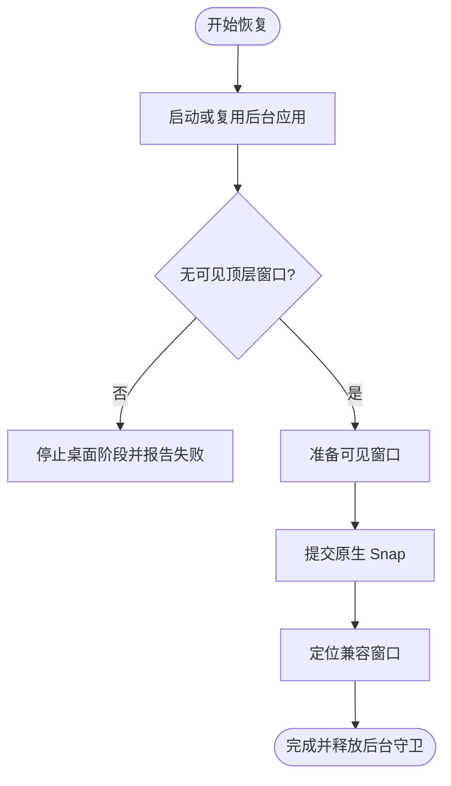

# 核心概念与行为边界

Snap Workspace 的关键不是“把窗口移动到某些坐标”，而是明确区分 Windows 原生 Snap、一次性兼容定位和严格后台启动。三者解决的问题不同，不能互相冒充。

## 工作区保存什么

一个工作区包含：

- 一个完整布局模型和多个归一化 Zone；
- 需要显示在桌面的窗口应用；
- 需要运行但不显示窗口的后台应用；
- 每个窗口的稳定身份和匹配规则；
- 应用的启动目标、参数、工作目录和实例策略；
- 捕捉时主工作区尺寸以及创建、更新时间。

工作区不保存长期有效的 HWND。HWND 是当前登录会话中的临时句柄，应用重启后会改变，因此只能在恢复时重新识别窗口。

## 原生 Snap 和普通定位的差别

普通 `SetWindowPos` 可以让窗口看起来位于某个区域，却不能证明 Windows 创建了 Snap Group。原生 Snap Group 还涉及 Windows Shell 内部的分组、分隔线、任务切换和布局状态。

Snap Workspace 的原生路径会：

1. 确认布局是完整、已验证的 Windows Snap Layout 模型；
2. 把每个 HWND 转换成当前 Shell 需要的 WindowId；
3. 一次性提交窗口和目标矩形数组；
4. 运行消息循环边界；
5. 读取 DWM 可见边界验证结果。

因此，原生提交之后不再做第二次几何校正。如果再用兼容定位强行移动同一窗口，它可能看似更整齐，却可能退出或破坏 Snap Group。项目把兼容定位限定为另一类窗口，绝不对已成功提交的原生窗口补一次 `SetWindowPos`。

## 三种应用角色

### 原生吸附窗口

原生窗口是工作区中唯一会进入 `SnapWindows` 的角色。

特征：

- 可见；
- 绑定一个布局 Zone；
- 属于单次批量提交；
- 受原生模型和最多 4 个窗口约束；
- 成功时继续由 Windows Snap 管理。

若应用窗口样式在恢复时明确不支持 Snap，它不会硬塞入批次，而是临时按对应 Zone 回退为兼容定位。这样其余可吸附窗口仍能形成原生批次。

### 兼容定位窗口

兼容窗口用于无法加入 Snap Group、但必须显示在桌面上的应用。

特征：

- 可见；
- 不绑定 Snap Zone；
- 保存独立的归一化矩形；
- 在原生 Snap 之后定位一次；
- 不持续监控、不永久置顶、不属于 Snap Group。

冷启动时，原生应用可能在兼容窗口定位后又自行激活并盖住它。恢复事务会对相交的兼容窗口执行短暂层级稳定，随后明确取消临时前景租约，使其恢复为普通非置顶窗口。这只是解决启动竞态，不是永久 Z-order 管理器。

### 后台应用

后台应用的产品语义是“工作区需要它运行，但恢复时桌面上没有它的窗口”。

特征：

- 不绑定 Zone；
- 不进入 `SnapWindows`；
- 作为桌面恢复的前置阶段；
- 在有限的恢复事务内阻止已有、新建和延迟显示的匹配顶层窗口；
- 事务结束后立即释放，之后的用户托盘点击不应再被拦截。

它不是 Windows 通用的“后台模式”API。部分应用有真正的无窗口命令行协议，部分只能使用启动提示与窗口事件拦截；管理员权限、跨进程代理或应用自带的自恢复逻辑可能使保证失败。

## 为什么后台失败会阻止桌面布局

如果用户指定后台应用，但它突然显示一个覆盖全屏的窗口，同时继续启动原生和兼容窗口，会产生难以预测的焦点与位置竞争。因此恢复把后台当作先决条件：



这保证“后台启动成功”不是只看进程存在。进程存在但没有可用前台窗口，也不能反过来证明一个桌面应用已经准备好。

## Chromium 浏览器为何特殊

Chrome、Edge、Brave、Vivaldi 和 Opera 通常是单实例、多进程架构。先普通启动再强制隐藏主窗口会污染现有浏览器会话：之后用户点击浏览器可能只有进程、没有正常窗口。

因此后台角色改用浏览器自己的 `--no-startup-window`：

- 不创建再隐藏主窗口；
- 不隐藏用户已经打开的浏览器窗口；
- 后续普通前台启动仍可创建窗口；
- 如果浏览器没有后台组件，进程可能自行退出，这不等同于失败地留下隐藏窗口。

如果你的需求是“后台预热 Chrome 且必须一直保留进程”，这超出了当前通用工作区语义，应由浏览器策略或专用启动参数管理。

## 完整布局与空槽位

Windows Snap Layout 是一个完整模型，但完整模型不要求每个 Zone 都有窗口。Snap Workspace 把“桌面可见”表示为未分配的 Zone。

正确的四宫格双应用：

```text
┌─────────────┬─────────────┐
│ 应用 A      │ 桌面        │
├─────────────┼─────────────┤
│ 桌面        │ 应用 B      │
└─────────────┴─────────────┘
```

布局仍有 4 个 Zone，只提交 A 和 B。错误做法是删除两个 Zone 或把剩余矩形任意拉伸；那会变成自定义几何，不能保证 Snap Group。

## 可视化编辑器为什么会吸附回模型

可视化编辑器允许拖分隔线、拆分、合并和移动应用，是为了更直观地选择模型，而不是提供 FancyZones 式任意区域编辑器。最终必须映射到内置原生模型：

- 能精确映射：可作为原生布局保存；
- 只能找到近似模型：用户确认后应用该原生比例；
- 无法映射：预检阻止原生提交，或改用兼容定位。

这样可以避免“窗口矩形正确但实际不受 Snap 控制”的假成功。

## 捕捉范围和应用角色不是一回事

捕捉范围回答“从哪里发现候选”：任务栏、通知区域、纯后台或手动点选。应用角色回答“恢复时怎么处理”：原生、兼容、后台或忽略。

例如：

- 从任务栏发现的窗口可以改成后台角色；
- 从通知区域发现的进程默认后台，但如果它有可捕捉窗口，也可经手动点选变成兼容窗口；
- 手动点选只改变发现来源，不绕过窗口样式和布局规则。

## 托盘分类的定义

“托盘 / 驻留应用”不是“所有隐藏窗口”。清单读取当前用户 Windows 通知区域注册，并与当前运行进程的可执行路径求交集。这样比把所有无任务栏窗口都当托盘程序更接近用户在任务栏右下角实际能看到的应用。

仍存在系统差异：通知区域缓存、打包应用代理和动态图标可能无法提供稳定路径。此时可用手动添加、纯后台范围或匹配规则补充。

## 窗口识别的逻辑

恢复时为每个窗口候选计算匹配结果。默认自动规则综合：

- AUMID 相同；
- 完整进程路径相同；
- 窗口类相同；
- 标题完全相同或部分相似。

显式规则可要求完整路径、文件名、标题完全相同、包含、通配符、正则或窗口类。候选最高分胜出；同分多候选会在预检中警告。

匹配和“应用进程是否存在”必须分开：一个浏览器可能有十几个进程却没有任何任务栏窗口；一个启动器进程也可能很快退出，把真正窗口交给子进程。恢复最终以符合身份规则的顶层窗口为准。

## 部分恢复的边界

可见窗口缺失和后台失败的处理不同：

- **某个可见窗口缺失**：只要仍有其他可见窗口，继续提交可用部分，缺失 Zone 显示桌面；
- **所有可见窗口都缺失**：停止并显示应用准备报告；
- **后台应用无法保证无窗口**：停止整个桌面阶段；
- **原生窗口运行时不支持 Snap**：路由到对应 Zone 的兼容定位；
- **Shell 不受支持或布局不是原生模型**：预检阻止原生调用。

## 工作区运行状态

一次成功恢复会记录：

- 本次管理的可见 HWND；
- 哪些窗口是复用的；
- 哪些窗口由本次恢复新启动；
- 新启动的后台应用数量。

“结束工作区”可以仅取消管理，或向本次新启动的可见窗口发送正常关闭请求。它不会终止后台进程，也不会关闭恢复前已经存在的窗口。

## 跨电脑复用性

工作区几何使用归一化比例，理论上可以适应不同主显示器分辨率；但完整复用还取决于：

- 目标电脑的 Shell 二进制是否通过 Route 3 探测；
- 软件是否安装在相同路径，或 AUMID 是否一致；
- 窗口类、标题及启动行为是否一致；
- DPI、任务栏位置和工作区尺寸；
- 应用是否支持 Snap 或后台协议。

`.snapworkspace` 适合备份和迁移定义，不代表应用本体或路径自动迁移。导入后应先检查每个启动目标，再执行恢复。
